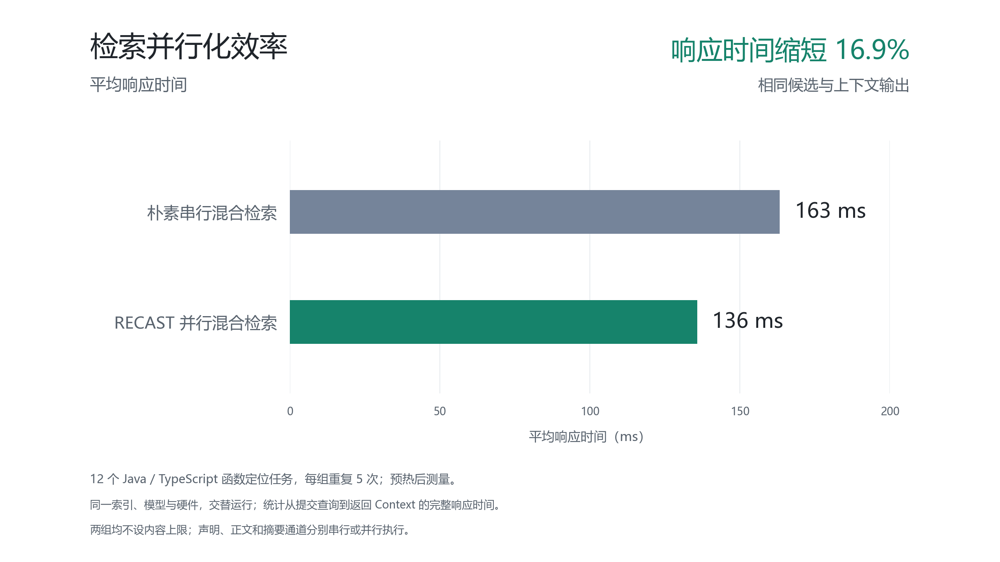

# 检索策略与响应效率展示

采用朴素串行混合检索作为效率基线，依次查询声明、源码正文与模块摘要，再完成候选融合及上下文构建。RECAST 将三个独立召回通道并行执行，候选范围、融合方式与上下文构建逻辑保持一致。

在同一批 12 个 Java / TypeScript 函数定位任务上，每组重复 5 次，平均完整响应时间由 **163 ms** 降至 **136 ms**，缩短 **16.9%**。两组返回的候选、源码、声明与关系内容逐次核对一致。

| 指标 | 朴素串行混合检索 | RECAST 并行混合检索 |
| --- | --- | --- |
| 平均响应时间，含检索与 Context 构建 | 163 ms | 136 ms |



## 图表与数据

- [PNG 展示图](context-efficiency.png)
- [SVG 矢量图](context-efficiency.svg)
- [PDF 矢量图](context-efficiency.pdf)
- [CSV 数据表](efficiency.csv)
- [精确数值与来源](efficiency.json)

## 统计口径

三组策略使用相同查询、索引快照、E5 模型与硬件，在同一轮实验中轮换执行顺序。均不设置 Token、文件数或源码行数上限，请求时限均为 10 秒。每组 12 题、每题重复 5 次，共 60 次请求，全部纳入统计，均无请求错误。

响应时间从本地 HTTP 提交查询开始，到接收完整 Context 响应结束，包含检索、源码读取与上下文构建。每题预热一次，预热、建库、模型加载及后续代码生成不计入该指标。

串行组保留与当前方案相同的查询向量缓存，每个通道内部仍采用全文与向量融合。两组只改变声明、正文及摘要三个通道的执行顺序。平均召回阶段耗时由 78 ms 降至 54 ms。

## 向量 Top-K 参考组

另外运行单通道向量检索，直接返回相似度最高的 10 个已有源码片段，采用相同 E5 与 HNSW 索引，不补充完整声明、模块或依赖。其平均响应时间为 **28 ms**，比完整 Context 流程更短。

这组参考说明单纯片段检索的开销；上图的 16.9% 改善仅对应输出一致的串行与并行混合检索。原来的 870 ms 与 168 ms 来自历史配置对照，不作为朴素检索策略的测试结果。

## 来源与复现

- [本轮原始报告](../../../logs/experiments/retrieval-strategies-20260909-run1/report.json)，主对照为 `serial-hybrid` 与 `full`，参考组为 `vector-topk`，均为 `budget=null`。

图表脚本核对任务、快照、环境、重复次数及全部原始响应，并对 60 对串行与并行输出执行内容相等断言后计算指标。

启动已有 SeekDB 和本地 E5 服务后运行：

```bash
node --import tsx scripts/run-guochuang-pilot.mts --budgets none --variants vector-topk,serial-hybrid,full --repeats 5
```

在安装了 Matplotlib 3.10.6 并可访问中文字体的 Python 环境中，从仓库根目录执行：

```bash
python scripts/render-context-efficiency.py --report logs/experiments/retrieval-strategies-20260909-run1/report.json --font /mnt/c/Windows/Fonts/msyh.ttc
```
